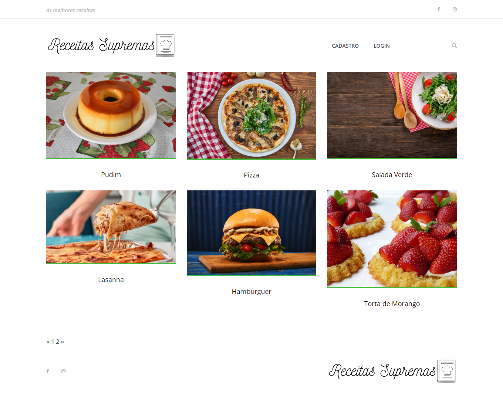
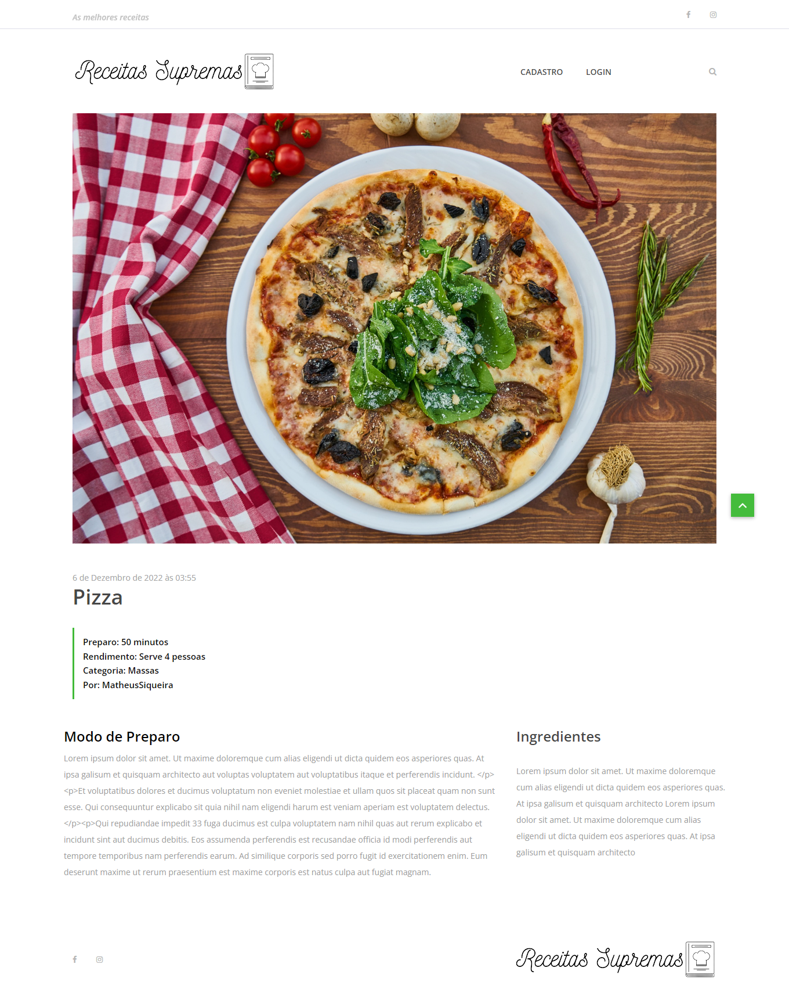
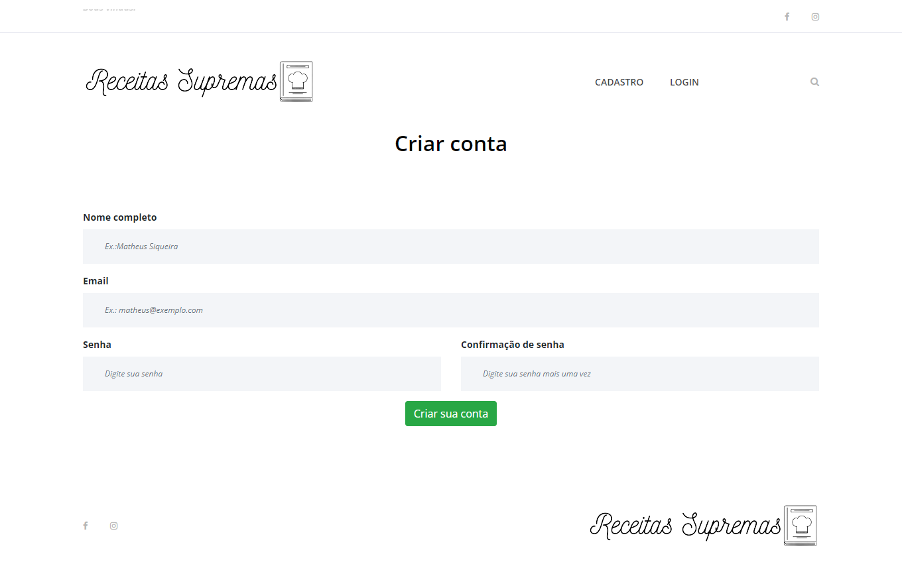
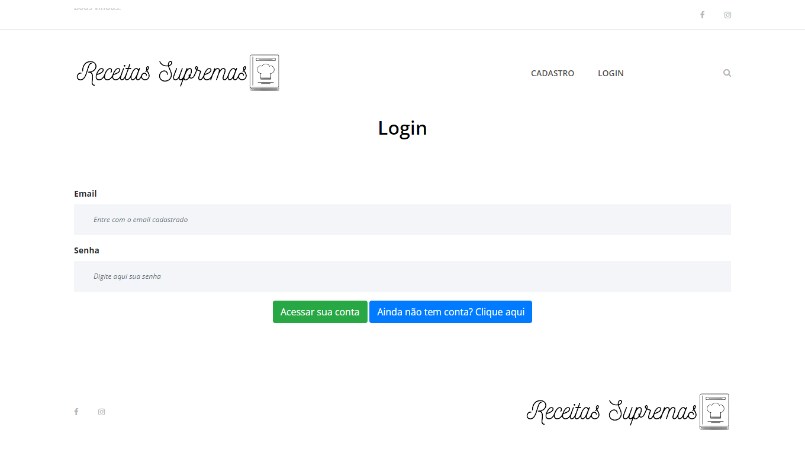
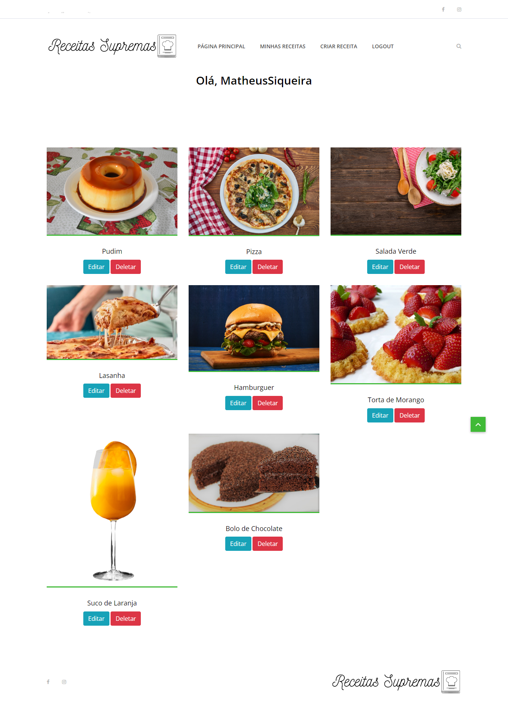
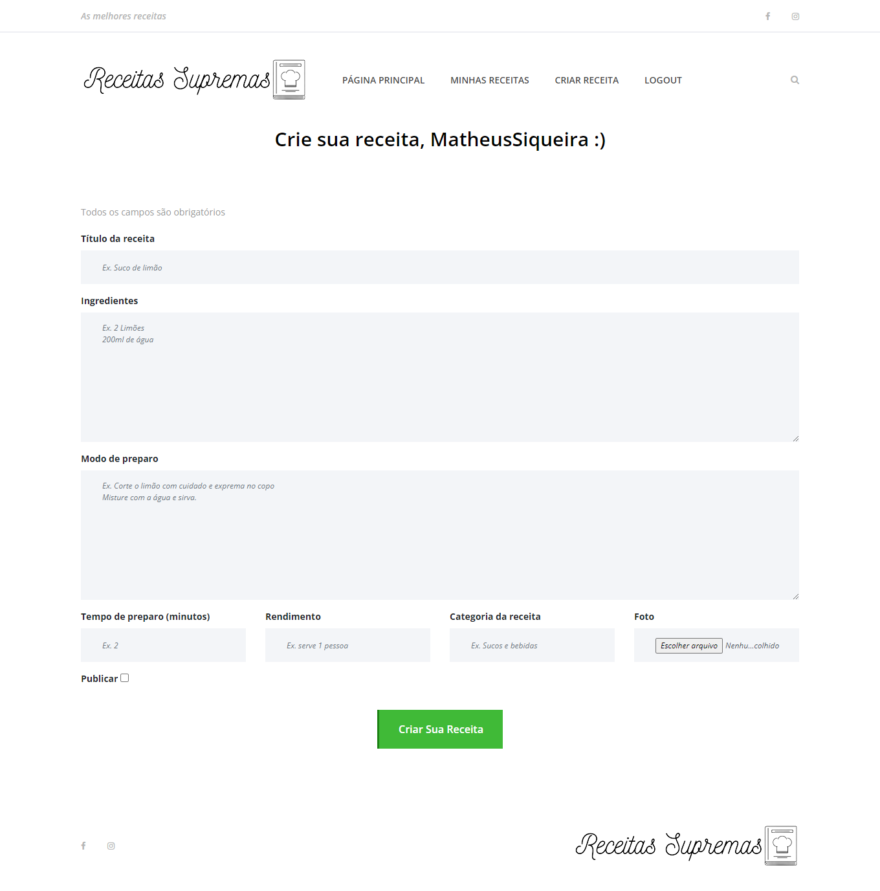

# 💻 Project 

In this project, I'm developing a recipes website, where any user can create their account and publish their recipes.

It's not finished yet. I'm developing in Django.

# Technologies

This project was developed with the following technologies:

- HTML and CSS
- Django
- JavaScript
<!-- - [Expo][expo] -->

# Gallery

##

# 💻 Projeto 

Neste projeto, estou desenvolvendo um site de receitas, onde qualquer usuário poderá criar sua conta e publiar suas receitas.

Não está finalizado ainda. Estou desenvolvendo em Django.

# Tecnologias

Este projeto foi desenvolvido com as seguintes tecnologias:

- HTML e CSS
- Django
- JavaScript
<!-- - [Expo][expo] -->

# Galeria

